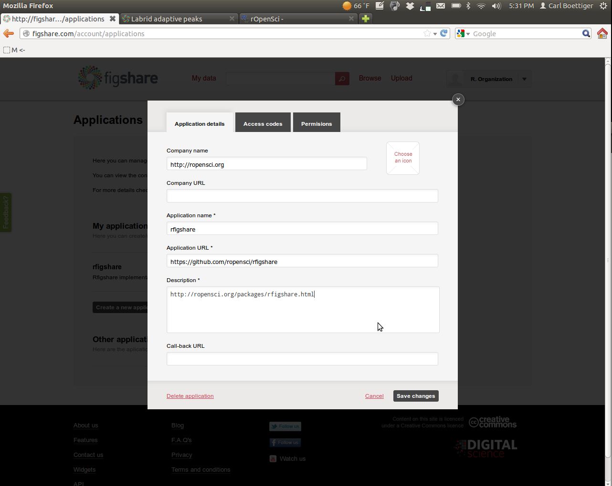

# Getting Started with rfigshare


## Obtaining your API keys

Create a user account on [FigShare](http://figshare.com) and log in.  From your homepage, select "Applications" from the drop-down menu,


Create a new application:


Enter in the following information: 



Then navigate over to the permissions tab.  To get the most out of `rfigshare` you'll want to enable all permissions:


Save the new settings, and then open the application again (View/Edit menu) and click on the "Access Codes" tab.


Record each if the keys into R as follows.  You might want to put this bit of R code into your `.Rprofile` to avoid entering it each time in the future:

```r
options(FigshareKey = "qMDabXXXXXXXXXXXXXXXXX")
options(FigsharePrivateKey = "zQXXXXXXXXXXXXXXXXXXXX")
options(FigshareToken = "SrpxabQXXXXXXXXXXXXXXXXXXXXXXXXXXXXXXXXXXXXXXXXXXXXXXXXXXXXXXXXXXX")
options(FigsharePrivateToken = "yqXXXXXXXXXXXXXXXXXXXX")
```

That's it! You are now ready to start using figshare.  Recall you can install the package directly from Github using: 

```r
require(devtools)
install_github("rfigshare", "ropensci")
```

Try authenticating with your credentials:

``` {r }
require(rfigshare)
figshare_auth()
````


There is a nice video introduction to creating applications for the API on the [figshare blog](http://figshare.com/blog/figshare_API_available_to_all/48).
