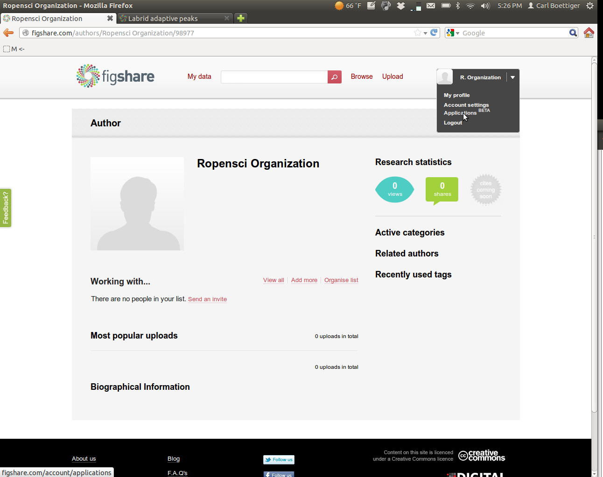
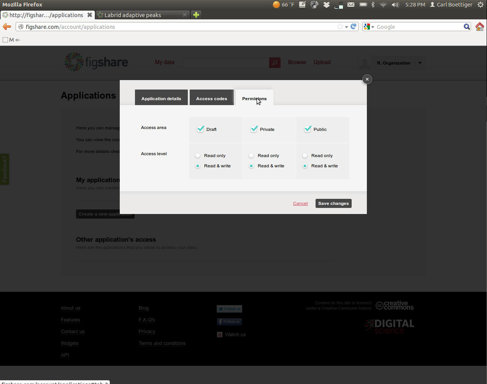

# Getting Started with rfigshare

![../../rfigshare.png]


## Obtaining your API keys

Create a user account on [FigShare](http://figshare.com) and log in.  From your homepage, select "Applications" from the drop-down menu,



Create a new application:


Enter in the following information: 


Then navigate over to the permissions tab.  To get the most out of `rfigshare` you'll want to enable all permissions:



Save the new settings, and then open the application again (View/Edit menu) and click on the "Access Codes" tab.


Record each if the keys into R as follows.  You might want to put this bit of R code into your `.Rprofile` to avoid entering it each time in the future:

```r
options(FigshareKey = "qMDabXXXXXXXXXXXXXXXXX")
options(FigsharePrivateKey = "zQXXXXXXXXXXXXXXXXXXXX")
options(FigshareToken = "SrpxabQXXXXXXXXXXXXXXXXXXXXXXXXXXXXXXXXXXXXXXXXXXXXXXXXXXXXXXXXXXX")
options(FigsharePrivateToken = "yqXXXXXXXXXXXXXXXXXXXX")
```

That's it! You are now ready to start using figshare.  Recall you can install the package directly from Github using: 

```r
require(devtools)
install_github("rfigshare", "ropensci")
```

Try authenticating with your credentials:


```r
require(rfigshare)
session <- figshare_auth()
```


Methods are still in development, with some still to be added and better formatting of output still coming. Here are a few examples:


```r
figshare_author_search("Boettiger", session)
```

```
## Response [http://api.figshare.com/v1/my_data/authors?search_for=Boettiger]
##   Status: 200
## {"pages": 0, "results": 1, "start": 0, "per_page": 10, "items": [{"id": "96387", "fname": "Carl", "lname": "Boettiger", "full_name": "Carl Boettiger", "job_title": "", "description": "", "facebook": "", "twitter": "", "active": 1}]} 
```

```r
figshare_article_details("138", session)
```

```
## Response [http://api.figshare.com/v1/my_data/articles/138]
##   Status: 200
## {"count": 1, "items": [{"article_id": 138, "title": "Labrid adaptive peaks", "views": 53, "downloads": 0, "shares": 0, "doi": "http://dx.doi.org/10.6084/m9.figshare.138", "defined_type": "figure", "status": "Public", "version": 1, "published_date": "13:45, Dec 30, 2011", "description": "Described in the notebook: http://openwetware.org/wiki/User:Carl_Boettiger/Notebook/Comparative_Phylogenetics/2010/03/12", "total_size": "29.71 KB", "owner": {"id": 96387, "full_name": "Carl Boettiger"}, "authors": [{"first_name": "Carl", "last_name": "Boettiger", "id": 96387, "full_name": "Carl Boettiger"}], "tags": [{"id": 277, "name": "comparative methods"}, {"id": 276, "name": "phylogenetics"}, {"id": 275, "name": "fins"}, {"id": 274, "name": "labrids"}], "categories": [{"id": 24, "name": "Evolutionary biology"}, {"id": 39, "name": "Ecology"}], "files": [{"size": "30 KB", "id": 137, "mime_type": "image/png", "name": "Labrid_fins.png"}], "links": []}]} 
```


There is a nice video introduction to creating applications for the API on the [figshare blog](http://figshare.com/blog/figshare_API_available_to_all/48).
